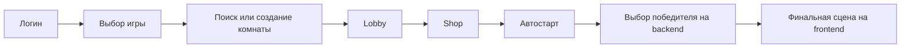
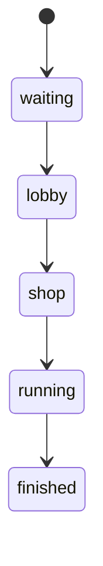
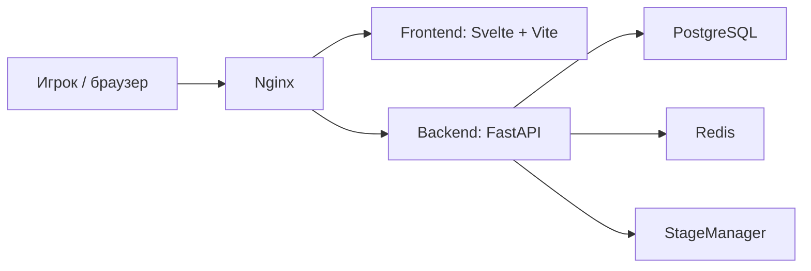

# СТОЛОТО VIP Room

Игровая платформа с комнатами, таймерами, докупкой мест и бустов, серверным выбором победителя, учётом денег и рабочей админкой. Внутри это не набор отдельных экранов, а цельный продуктовый контур: от выбора игры и входа в комнату до расчёта выигрыша, истории раундов и административного контроля. Локально приложение открывается по адресу `http://localhost:8090`.

## Как работает продукт



Игрок авторизуется, выбирает игру и ставку, после чего фронтенд отправляет `POST /api/room/search`. Backend подбирает подходящий паттерн комнаты и либо находит уже открытую комнату, либо создаёт новую. Дальше пользователь не прыгает по разрозненным страницам: состояние комнаты, таймеры, шанс победы и банк раунда последовательно ведут его через весь сценарий.

Дальше раунд идёт по понятному циклу:

1. В `lobby` игрок занимает слот и оплачивает вход.
2. Когда лобби набирает достаточно участников или заканчивается таймер, комната переходит в `shop`.
3. В `shop` можно докупить ещё слот или усилить один из своих слотов бустом.
4. После таймера комната уходит в `running`.
5. Если мест не хватает, backend может дозаполнить комнату ботами.
6. Победитель выбирается на сервере, баланс обновляется там же, а фронтенд просто показывает уже готовый результат.



`waiting` означает, что комната уже создана, но ещё не начала движение. `lobby` нужен для набора игроков, `shop` для короткой докупки перед стартом, `running` для серверного завершения раунда, `finished` для уже зафиксированного результата. В `lobby` и `shop` интерфейс живёт в realtime через SSE, поэтому игрок видит обновление таймера, мест и банка без ручного перезапроса страницы.

## Как считается шанс победы

В основе механики не просто список игроков, а список слотов. Каждый слот имеет вес:

```text
вес слота = 100 + boost
вес игрока = сумма весов всех его слотов
общий вес комнаты = сумма весов всех слотов комнаты

chance_current  = вес игрока / общий вес комнаты
chance_capacity = вес игрока / (общий вес комнаты + 100 * свободные_места)
```

`chance_current` показывает шанс среди уже занятых мест. `chance_capacity` показывает шанс с учётом того, что пустые места ещё могут заняться обычными слотами без буста. Именно этот второй вариант и показывается игроку в `shop`, потому что он честнее отражает ситуацию до старта раунда.

Простой пример: если у игрока два слота с весами `100` и `105`, то его вес равен `205`. Если общий вес комнаты сейчас `810`, а свободно ещё два места, то:

```text
chance_current  = 205 / 810  = 25.3%
chance_capacity = 205 / 1010 = 20.3%
```

В магазине действует ограничение: после покупки шанс игрока не должен стать выше `50%`. Это правило проверяется на backend и одинаково работает и для покупки дополнительного слота, и для буста.

Когда комната переходит в `running`, сервер делает взвешенный случайный выбор по всем слотам комнаты. Чем больше суммарный вес слотов игрока, тем выше шанс, но сам победитель определяется только на backend.

## Как считаются деньги

Деньги в проекте не разбрасываются по разным местам. Вход в комнату, покупка дополнительного слота и покупка буста сначала попадают в `room_escrow`, а затем уже при завершении раунда распределяются между победителем и Stoloto VIP Room.

Формула расчёта такая:

```text
stake_fund    = количество_слотов * join_cost
boost_fund    = сумма_всех_boost * boost_cost_per_point
vip_room_cut  = floor(stake_fund * rank / 100)
winner_payout = stake_fund - vip_room_cut + boost_fund
```

То есть доля Stoloto VIP Room берётся с входов в комнату, а деньги за бусты добавляются к выплате победителю. Все движения пишутся в `ledger_entries`, поэтому любую спорную ситуацию можно восстановить по событиям, а не по догадкам.

## Архитектура



Фронтенд отвечает за витрину, лобби, shop, профиль, игровые сцены и админку. Backend держит авторизацию, комнаты, паттерны, расчёт победителя, финансовый учёт, аналитику и административные API. PostgreSQL хранит пользователей, комнаты, слоты, паттерны и ledger. Redis используется для блокировок stage manager. Снаружи всё собирается через `nginx`, чтобы приложение поднималось как единый контур.

Отдельно важен `StageManager`: это фоновая логика, которая сама двигает комнаты между стадиями, следит за таймерами и завершает раунды даже без действий со стороны пользователя. За счёт этого игровой процесс не зависит от того, держит ли кто-то страницу открытой прямо сейчас.

С точки зрения отказоустойчивости здесь важен и другой момент: состояние игры живёт не в памяти браузера и не в памяти конкретного backend-процесса. Основные данные лежат в PostgreSQL, а фронтенд в любой момент может перечитать текущее состояние комнаты, профиля и результата раунда.

## Горизонтальное масштабирование

Проект можно масштабировать горизонтально без полной переделки логики. Для этого здесь уже есть несколько важных технических опор.

Авторизация сделана через JWT в cookie `session_id`, поэтому backend не привязан к in-memory сессиям конкретного процесса. Любой экземпляр приложения, у которого есть тот же `SECRET_KEY`, может принять запрос пользователя и провалидировать его токен.

Игровое состояние и финансовый контур хранятся в PostgreSQL, а критичные операции защищены через `pg_advisory_xact_lock`. Это помогает не допускать гонок при входе в комнату, покупке слота, покупке буста, возвратах и завершении игры, даже если запросы прилетают параллельно.

Фоновый `StageManager` координируется через Redis-лок, поэтому в кластере может быть несколько backend-инстансов, но активный цикл обработки стадий в конкретный момент будет только у одного. Это важно для переходов между `lobby`, `shop`, `running` и `finished`.

На практике это означает, что backend можно ставить за балансировщик и масштабировать вширь, если все инстансы смотрят в общие PostgreSQL и Redis и используют одинаковую конфигурацию. Для realtime-части с SSE это тоже подходит: соединение обслуживает тот инстанс, на который попал запрос, а состояние комнаты он читает из общей базы.

## Админка

Админский контур сделан как рабочий инструмент. В интерфейсе есть три основные зоны: работа с паттернами, аналитика и список отключённых паттернов.

Во вкладке с паттернами администратор управляет самой игровой сеткой: задаёт общее ограничение на количество создаваемых комнат, создаёт новые паттерны и редактирует существующие. Для каждого паттерна настраиваются игра, цена входа, число мест, процент Stoloto VIP Room (`rank`), время ожидания в `lobby`, время ожидания в `shop`, лимит комнат для этого паттерна и его приоритет в матчмейкинге. Удаление сделано мягко: паттерн уходит из активного списка, но остаётся доступен в разделе удалённых.

Во вкладке аналитики собран полноценный операционный экран. Там есть KPI по проекту, график выручки, воронка по стадиям, топ паттернов, топ игроков и топ комнат. Рядом с этим лежат инструменты контроля: просмотр аномалий, сверка баланса Stoloto VIP Room и аудит через `ledger` с фильтрами по комнате, пользователю, типу записи и диапазону дат, плюс выгрузка в CSV.

На уровне backend есть и более глубокий административный слой. Через admin API можно менять системные настройки, включая внутренний баланс Stoloto VIP Room (`casino_balance`), `bots_enabled`, минимальную и максимальную ставку, искать пользователей, смотреть их историю и текущую игру, корректировать баланс, искать комнаты, открывать карточку конкретной комнаты, смотреть историю завершённых комнат, а при необходимости принудительно завершать раунд или делать возврат средств. Это делает админку полезной не только для настройки проекта, но и для ежедневного сопровождения живой эксплуатации.

Иными словами, админка здесь закрывает сразу три задачи: настройку экономики, наблюдение за метриками и ручное сопровождение спорных ситуаций.

## Запуск

Проще всего поднимать проект из корня:

```bash
copy .\stoloto-backend\.env.example .\stoloto-backend\.env
docker-compose up --build
```

После запуска будут доступны:

- приложение: `http://localhost:8090`
- backend: `http://localhost:8000`
- PostgreSQL: `localhost:5498`
- Redis: `localhost:6379`

Для любого окружения, кроме локального демо, значения из `.env.example` нужно заменить на свои: прежде всего секрет JWT, параметры PostgreSQL и CORS-настройки.

## Демо-данные

В инициализации уже есть тестовые пользователи:

- `admin` / `123`
- `user1 ... user100` / `123`
- `bot1 ... bot100`

Там же создаются стартовые паттерны для `wheel`, `aviator`, `plinko` и `minesweeper`.

## Следующий этап развития

Если смотреть на проект как на уже собранную основу, то следующий roadmap выглядит довольно понятно.

1. Довести продукт до полноценного боевого контура: добавить production-настройки безопасности, нормальный контур ролей, ограничение частоты запросов, более строгий аудит действий и стабильный staging перед выкладкой.
2. Усилить игровой слой: расширить механику комнат, добавить больше сценариев для `shop`, гибче настраивать экономику паттернов и вынести часть продуктовых экспериментов в админку, чтобы ими можно было управлять без правок кода.
3. Развить финансовый контур: подключить полноценный кошелёк, внешние платёжные сценарии, историю пополнений и списаний, а также более детальные отчёты по доходу, выплатам и спорным операциям.
4. Сделать админку ещё сильнее как операционный центр: добавить более глубокие карточки игрока и комнаты, ручную модерацию, заметки по инцидентам, флаги риска и более наглядную работу с аномалиями.
5. Подготовить проект к росту нагрузки: выделить фоновые процессы в отдельный рабочий контур, добавить мониторинг, алерты, нагрузочные тесты и окончательно оформить схему горизонтального масштабирования для нескольких backend-инстансов.

Иными словами, база уже собрана. Следующий шаг для этого проекта не в том, чтобы заново придумывать продукт, а в том, чтобы довести его до уровня устойчивой, масштабируемой и операционно удобной платформы.

## После запуска

После первого старта проект уже готов к нормальной локальной проверке. Можно зайти под обычным пользователем, открыть витрину, войти в комнату, пройти путь `lobby -> shop -> finished` и посмотреть, как меняются шанс, банк и итоговый результат раунда. Отдельно можно зайти под `admin` и проверить паттерны, аналитику, ledger и системные настройки.

По сути, после `docker-compose up --build` здесь поднимается не сырой шаблон, а уже собранное приложение Stoloto VIP Room с пользовательским потоком, игровой логикой, финансовым учётом и административным слоем.
